% Optimizando el desempeño académico
% Equipo JJAR (Julieta, José, Alonso, Rebe)

# Optimizando calificaciones para maximizar la nota final
## O: ¿Por fin voy a pasar eco 2?

# Planteamiento
Queremos optimizar el promedio de un semestre dado que ya pasaron bajas

. . .

😔👌

## Función de calificación

Queremos encontrar la mayor calificación final posible que podríamos obtener
dado que ya conocemos la calificación del 'primer parcial'.

Para no caer en un problema lineal consideramos funciones de
calificación no-lineales.

. . .

Por ejemplo: Peso de parciales depende de si es el más alto o bajo

$$
C(p, y) := \frac{1}{5} p_{\text{lo}} + \frac{2}{5} \left(
\sum_{i} p_{i} \right)
+ \frac{2}{5} y
$$

----

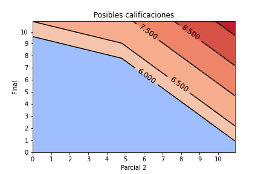{.stretch}

# ¿Qué tan probable es tener $x \text{ }$  de calificación Final?

. . .

## Asumiendo que las calificaciones se distribuyen gamma

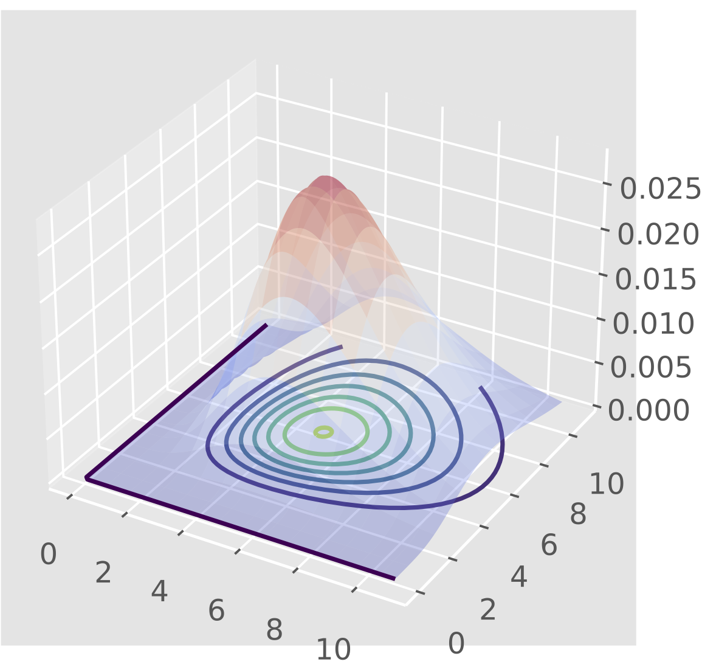{.stretch}

## Juntando ambas ideas

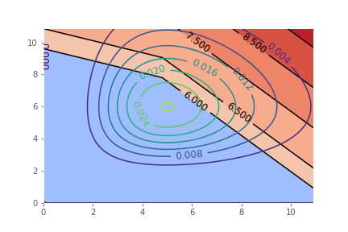{.stretch}

----

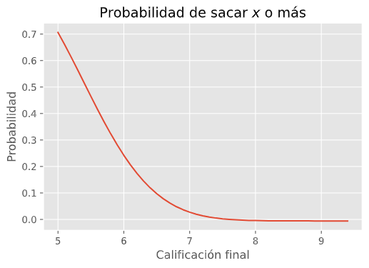{.stretch}

# ¿Cuál es nuestra función a optimizar?
## Función score

Calcula las posibles calificaciones finales dados los datos,
criterios de calificación y calificaciones dadas, ponderando por la probabilidad de obtener dicha calificación.

Variables de optimización: $x, y$

-----

Concretamente:

Sean $X, Y \sim \text{Ga}(\alpha_i, \beta_i)$ v.a's independientes.

. . .

$X$ representa parcial restante, $Y$ examen final.

$$
\text{Score}(x,y) := C(p, y) * f_{X, Y} (x, y)
$$

. . .

Donde $C(p, y)$ es la función de calificaciones y $f_{X, Y}$ la f.d.p
conjunta de $X, Y$.

## ¿Cómo se ve score?

{.stretch}

-----

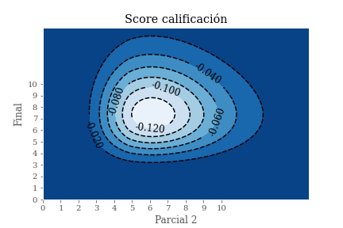{.stretch}

-----

Obtenemos la máxima posible calificación $×$ probabilidad de sacarla.

# ¿Cómo optimizamos?

Algoritmo de Región de Confianza

- método de Dogleg

----

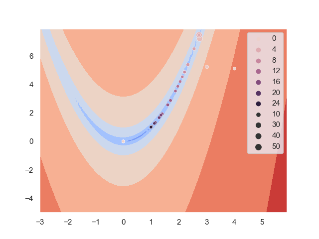{.stretch}

# Resultados

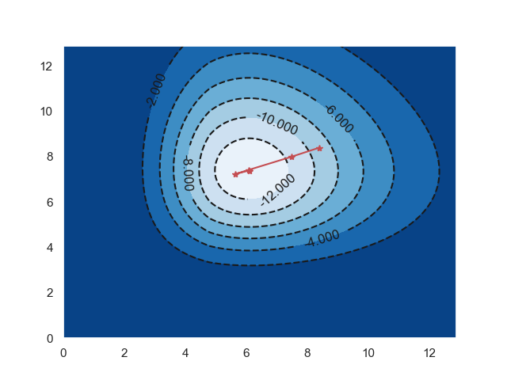{.stretch}

----

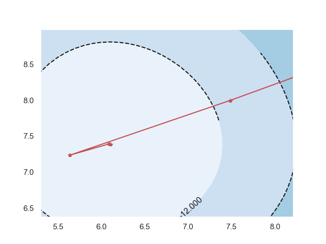{.stretch}

## Solución en (6.10, 7.38)

# Problemas de convergencia

## No converge en todos lados

. . .

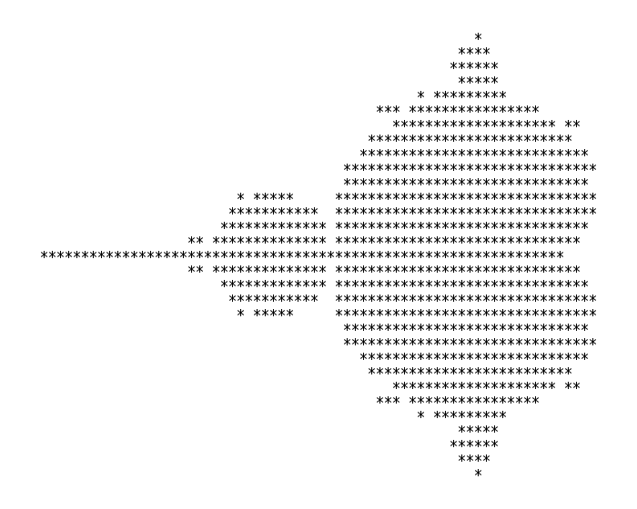{.stretch}

-----

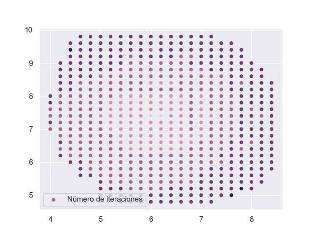{.stretch}

-----

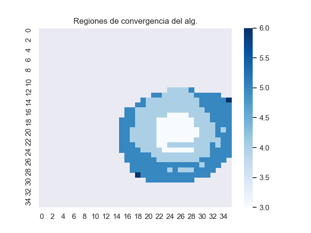{.stretch}

# Áreas de oportunidad

::: incremental
- El modelo propuesto no es muy bueno
- Posible problema de escalamiento (pg.26)
- numdifftools
:::
